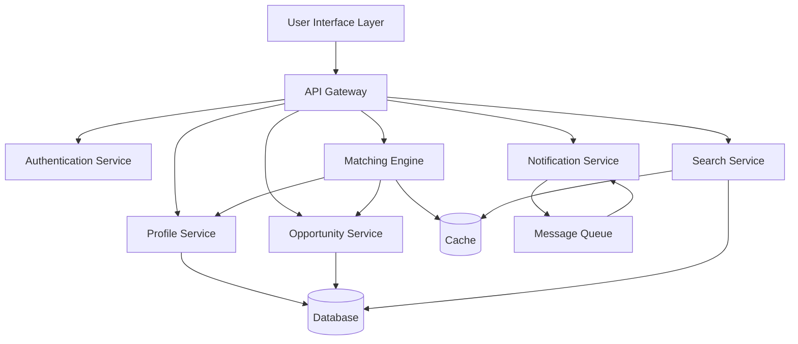

# Design Document: SaarthiAI – AI Opportunity Discovery Platform

## Overview

SaarthiAI is an AI-powered platform that helps students discover scholarships, internships, research programs, and government initiatives by analyzing their profiles and matching them with relevant opportunities. The system addresses awareness blindspots by surfacing low-visibility opportunities and providing explainable recommendations.

The platform consists of three main layers:
1. **Data Layer**: Manages student profiles and opportunity data
2. **Matching Engine**: Performs intelligent matching between students and opportunities
3. **Presentation Layer**: Provides user interfaces for discovery, tracking, and notifications

## Architecture

The system follows a modular architecture with clear separation of concerns:



### Key Architectural Decisions

1. **Microservices Architecture**: Services are independently deployable and scalable
2. **Event-Driven Notifications**: Asynchronous notification processing via message queue
3. **Caching Strategy**: Frequently accessed data (opportunities, match results) cached for performance
4. **Separation of Matching Logic**: Matching engine is isolated for independent optimization and testing

## Components and Interfaces

### 1. Profile Service

Manages student profile data including creation, updates, validation, and retrieval.

**Interface:**
```typescript
interface ProfileService {
  createProfile(studentData: StudentProfileInput): Result<StudentProfile>
  updateProfile(studentId: string, updates: Partial<StudentProfileInput>): Result<StudentProfile>
  getProfile(studentId: string): Result<StudentProfile>
  validateProfile(profile: StudentProfileInput): ValidationResult
  getIncompleteFields(profile: StudentProfile): string[]
}

interface StudentProfile {
  id: string
  academicLevel: EducationLevel
  gpa: number
  major: string
  skills: string[]
  interests: string[]
  location: Location
  demographics: Demographics
  createdAt: Date
  updatedAt: Date
}

interface StudentProfileInput {
  academicLevel: EducationLevel
  gpa?: number
  major?: string
  skills?: string[]
  interests?: string[]
  location?: Location
  demographics?: Demographics
}

type EducationLevel = "high_school" | "undergraduate" | "graduate" | "doctoral"

interface Location {
  country: string
  state?: string
  city?: string
}

interface Demographics {
  age?: number
  gender?: string
  ethnicity?: string
  firstGeneration?: boolean
}

interface ValidationResult {
  valid: boolean
  errors: ValidationError[]
}

interface ValidationError {
  field: string
  message: string
}
```

### 2. Opportunity Service

Manages opportunity data including CRUD operations, categorization, and expiration tracking.

**Interface:**
```typescript
interface OpportunityService {
  createOpportunity(data: OpportunityInput): Result<Opportunity>
  updateOpportunity(id: string, updates: Partial<OpportunityInput>): Result<Opportunity>
  getOpportunity(id: string): Result<Opportunity>
  listActiveOpportunities(): Result<Opportunity[]>
  markExpired(id: string): Result<void>
  getOpportunitiesByType(type: OpportunityType): Result<Opportunity[]>
}

interface Opportunity {
  id: string
  title: string
  description: string
  type: OpportunityType
  eligibilityCriteria: EligibilityCriteria
  deadline: Date
  benefits: Benefits
  applicationRequirements: string[]
  source: string
  visibilityLevel: VisibilityLevel
  isExpired: boolean
  createdAt: Date
  updatedAt: Date
}

interface OpportunityInput {
  title: string
  description: string
  type: OpportunityType
  eligibilityCriteria: EligibilityCriteria
  deadline: Date
  benefits: Benefits
  applicationRequirements: string[]
  source: string
  visibilityLevel: VisibilityLevel
}

type OpportunityType = "scholarship" | "internship" | "research_program" | "government_initiative"

type VisibilityLevel = "high" | "medium" | "low"

interface EligibilityCriteria {
  minGPA?: number
  maxGPA?: number
  academicLevels?: EducationLevel[]
  majors?: string[]
  skills?: string[]
  locations?: Location[]
  minAge?: number
  maxAge?: number
  demographics?: Partial<Demographics>
}

interface Benefits {
  monetaryAmount?: number
  currency?: string
  description: string
}
```

### 3. Matching Engine

Performs intelligent matching between student profiles and opportunities, calculating relevance scores and generating explanations.

**Interface:**
```typescript
interface MatchingEngine {
  findMatches(studentId: string): Result<MatchResult[]>
  calculateMatch(profile: StudentProfile, opportunity: Opportunity): MatchScore
  explainMatch(profile: StudentProfile, opportunity: Opportunity, score: MatchScore): MatchExplanation
  rankMatches(matches: MatchResult[]): MatchResult[]
}

interface MatchResult {
  opportunity: Opportunity
  score: MatchScore
  explanation: MatchExplanation
}

interface MatchScore {
  overall: number  // 0-100
  components: {
    academicMatch: number
    skillMatch: number
    interestMatch: number
    locationMatch: number
    demographicMatch: number
  }
  confidence: number  // 0-100
}

interface MatchExplanation {
  summary: string
  matchedCriteria: CriteriaMatch[]
  unmatchedCriteria: CriteriaMatch[]
  contributingFactors: Factor[]
}

interface CriteriaMatch {
  criterion: string
  studentValue: any
  requiredValue: any
  matches: boolean
}

interface Factor {
  name: string
  contribution: number  // percentage contribution to overall score
  description: string
}
```

### 4. Search Service

Provides keyword search and filtering capabilities across opportunities.

**Interface:**
```typescript
interface SearchService {
  search(query: SearchQuery): Result<SearchResult[]>
  saveSearchQuery(studentId: string, query: SearchQuery): Result<SavedSearch>
  getSavedSearches(studentId: string): Result<SavedSearch[]>
}

interface SearchQuery {
  keywords?: string
  filters?: SearchFilters
  studentId?: string  // for personalized ranking
}

interface SearchFilters {
  types?: OpportunityType[]
  locations?: Location[]
  deadlineStart?: Date
  deadlineEnd?: Date
  minBenefit?: number
  maxBenefit?: number
}

interface SearchResult {
  opportunity: Opportunity
  relevanceScore: number
  matchScore?: MatchScore  // if studentId provided
  explanation?: MatchExplanation  // if studentId provided
  highlights: string[]  // matched text snippets
}

interface SavedSearch {
  id: string
  studentId: string
  query: SearchQuery
  name: string
  createdAt: Date
}
```

### 5. Notification Service

Manages notifications for new opportunities, deadline reminders, and custom alerts.

**Interface:**
```typescript
interface NotificationService {
  sendNotification(notification: Notification): Result<void>
  scheduleDeadlineReminders(studentId: string, opportunityId: string): Result<void>
  updatePreferences(studentId: string, preferences: NotificationPreferences): Result<void>
  getPreferences(studentId: string): Result<NotificationPreferences>
}

interface Notification {
  studentId: string
  type: NotificationType
  title: string
  message: string
  opportunityId?: string
  scheduledFor?: Date
}

type NotificationType = "new_opportunity" | "deadline_reminder" | "status_update"

interface NotificationPreferences {
  email: boolean
  inApp: boolean
  frequency: NotificationFrequency
  deadlineReminders: DeadlineReminderSettings
}

type NotificationFrequency = "immediate" | "daily_digest" | "weekly_digest"

interface DeadlineReminderSettings {
  enabled: boolean
  intervals: number[]  // days before deadline [7, 3, 1]
}
```

### 6. Tracking Service

Manages student tracking of opportunities and application status.

**Interface:**
```typescript
interface TrackingService {
  trackOpportunity(studentId: string, opportunityId: string): Result<TrackedOpportunity>
  untrackOpportunity(studentId: string, opportunityId: string): Result<void>
  updateStatus(studentId: string, opportunityId: string, status: ApplicationStatus): Result<TrackedOpportunity>
  getTrackedOpportunities(studentId: string): Result<TrackedOpportunity[]>
}

interface TrackedOpportunity {
  studentId: string
  opportunityId: string
  status: ApplicationStatus
  trackedAt: Date
  updatedAt: Date
}

type ApplicationStatus = "not_started" | "in_progress" | "submitted" | "accepted" | "rejected"
```

## Data Models

### Database Schema

The platform uses a relational database with the following core tables:

**students**
- id (UUID, primary key)
- email (string, unique)
- password_hash (string)
- created_at (timestamp)
- updated_at (timestamp)

**student_profiles**
- id (UUID, primary key)
- student_id (UUID, foreign key → students.id)
- academic_level (enum)
- gpa (decimal)
- major (string)
- skills (jsonb)
- interests (jsonb)
- location (jsonb)
- demographics (jsonb)
- created_at (timestamp)
- updated_at (timestamp)

**opportunities**
- id (UUID, primary key)
- title (string)
- description (text)
- type (enum)
- eligibility_criteria (jsonb)
- deadline (timestamp)
- benefits (jsonb)
- application_requirements (jsonb)
- source (string)
- visibility_level (enum)
- is_expired (boolean)
- created_at (timestamp)
- updated_at (timestamp)

**tracked_opportunities**
- id (UUID, primary key)
- student_id (UUID, foreign key → students.id)
- opportunity_id (UUID, foreign key → opportunities.id)
- status (enum)
- tracked_at (timestamp)
- updated_at (timestamp)
- unique constraint on (student_id, opportunity_id)

**saved_searches**
- id (UUID, primary key)
- student_id (UUID, foreign key → students.id)
- name (string)
- query (jsonb)
- created_at (timestamp)

**notifications**
- id (UUID, primary key)
- student_id (UUID, foreign key → students.id)
- type (enum)
- title (string)
- message (text)
- opportunity_id (UUID, foreign key → opportunities.id, nullable)
- read (boolean)
- scheduled_for (timestamp, nullable)
- sent_at (timestamp, nullable)
- created_at (timestamp)

**notification_preferences**
- id (UUID, primary key)
- student_id (UUID, foreign key → students.id, unique)
- email_enabled (boolean)
- in_app_enabled (boolean)
- frequency (enum)
- deadline_reminders (jsonb)
- updated_at (timestamp)

### Indexes

For optimal query performance:
- `student_profiles.student_id` (unique)
- `opportunities.deadline` (for expiration checks)
- `opportunities.type` (for filtering)
- `opportunities.is_expired` (for active opportunity queries)
- `tracked_opportunities.student_id` (for user tracking lists)
- `tracked_opportunities.opportunity_id` (for reverse lookups)
- `notifications.student_id, notifications.read` (for unread notifications)
- `notifications.scheduled_for` (for notification processing)

### Caching Strategy

**Cache Keys:**
- `profile:{studentId}` → StudentProfile (TTL: 1 hour)
- `opportunity:{opportunityId}` → Opportunity (TTL: 6 hours)
- `active_opportunities` → Opportunity[] (TTL: 30 minutes)
- `matches:{studentId}` → MatchResult[] (TTL: 1 hour)
- `search:{queryHash}` → SearchResult[] (TTL: 15 minutes)

**Cache Invalidation:**
- Profile updates invalidate `profile:{studentId}` and `matches:{studentId}`
- Opportunity updates invalidate `opportunity:{opportunityId}`, `active_opportunities`, and all `matches:*`
- New opportunities invalidate `active_opportunities` and all `matches:*`

